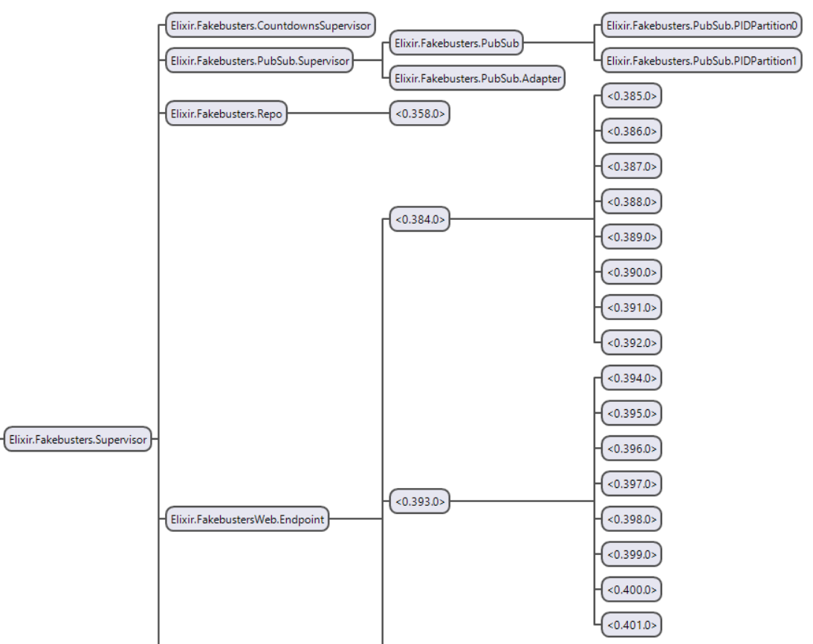

# 3W Sherlocks
[🔗 Check it out!](https://bourse2021-coddity.anicetnougaret.fr)

# Documentation [FR]

- [🔧 Installation](#-installation)
  - [Envionnement Dev](#envionnement-dev)
- [🧭 Visite guidée du code source](#-visite-guidée-du-code-source)
  - [Fakebusters et FakebustersWeb](#fakebusters-et-fakebustersweb)
  - [Code autogénéré et code fait main](#code-autogénéré-et-code-fait-main)
  - [MVC](#mvc)
  - [Arbre de supervision](#arbre-de-supervision)
  - [Où est le JS ???](#où-est-le-js-)
  - [Mix et config](#mix-et-config)
  - [Migrations](#migrations)
  - [Tests](#tests)
  - [Docker](#docker)
- [👩‍💻 Commandes utiles](#-commandes-utiles)
  - [Reset la base de donnée](#reset-la-base-de-donnée)
  - [Dump et load la base donnée](#dump-et-load-la-base-donnée)
  - [Formater le code](#formater-le-code)
  - [Lancer l'analyse statique du code](#lancer-lanalyse-statique-du-code)
  - [Tester le code](#tester-le-code)
- [💡 Resources utiles](#-resources-utiles)

## 🔧 Installation
### Envionnement Dev
1. Mettez en place une base de donnée PostgreSQL avec identifiant `postgres` et mot de passe `postgres` sur `localhost:5432`
   - Avec docker 🐳 : `docker run --name postgres-fakebusters -e POSTGRES_PASSWORD=postgres -d -p 5432:5432 postgres:alpine` 
   - [Sans docker](https://www.postgresql.org/download/)
2. Installez Elixir [Windows](https://elixir-lang.org/install.html#windows) | [Linux](https://elixir-lang.org/install.html#gnulinux) | [Mac](https://elixir-lang.org/install.html#macos)
3. Installez [NPM](https://www.npmjs.com/)
4. Faites `mix setup`
5. Faites `cd assets`, `npm install` puis `cd ..`
6. Lancez le serveur `mix phx.server`
7. [Amusez-vous bien :)](http://localhost:4000)

## 🧭 Visite guidée du code source
*Note au lecteur : l'ancien nom de code du projet étant "fakebusters", il est resté le nom du projet au sein du code source.*

Le code est organisée de façon monolithique, le back et le front dans un même projet Elixir dont la racine est le répertoire actuel.

### Fakebusters et FakebustersWeb

Structuré selon les bonnes pratiques recommandées par la communauté Elixir, telles que l'utilisation du ["domain driven design"](https://en.wikipedia.org/wiki/Domain-driven_design) et de certaines briques du MVC (imposées par Phoenix). 

Le code source est organisé en deux modules Elixir de premier niveau :

- `lib/fakebusters` Partie "Model" en MVC standard, il contient les APIs minimales nécessaires à l'exploitation de la logique métier et de la modélisation des données.
- `lib/fakebusters_web` Partie "View", "Controller", et bien plus encore. La seule limite est que le code soit exclusif à une interface "web", c'est à dire par WebSockets, APIs HTTP, templates (.eex) et LiveViews (.leex). Si l'on souhaitait par la suite faire un tchat bot ou une GUI avec les bindings Erlang d'OpenGL (pitié ne faites pas ça) nous pourrions créer un autre module du même genre. 

Par ailleurs, les relations de dépendances entre ces deux parties sont strictes, `fakebusters_web` dépend de `fakebusters` mais jamais l'inverse.

### Code autogénéré et code fait main
Phoenix propose de nombreux générateurs. Pour différencier mon code du code généré, compliqué car ils sont tous les deux ~~d'excellente qualité~~.

90% du code lié à l'authentification fut généré par [phx_gen_auth](https://github.com/aaronrenner/phx_gen_auth)

50% du code des contextes (comme [Fakebusters.Accounts](lib/fakebusters/accounts.ex) par exemple) fut généré lors de la création de chaque contexte avec `phx.gen.context`.

### MVC
Comme expliqué ci-dessus, Phoenix impose un simili de modèle MVC.

#### Models & contexts
Le modèle est découpe en trois "contextes" qui correspondent à la partie Models de MVC :

- [Fakebusters.Accounts](lib/fakebusters/accounts.ex) Gère l'authent.
- [Fakebusters.Boards](lib/fakebusters/boards.ex) Gère les investigations, les messages et les votes.
- [Fakebusters.Topics](lib/fakebusters/topics.ex) Gère les tags. J'ai décidé de le séparer pour le rendre réutilisable pour d'autres features plus tard.

Dans les sous dossiers de ces trois contextes l'on retrouve les schémas et les "changesets" (= des règles de validations).

Ce découpage est arbitraire et n'a pas d'autres conséquences que l'organisation du code.

#### Views
Les Views sont dans le dossier `lib/fakebusters_web/views` mais ne contiennent que peu de code. 

Les templates .eex sont situés dans des sous dossiers aux noms de views dans `lib/fakebusters_web/templates`.

Les templates peuvent inclurent d'autres templates et des LiveViews, la requête est alors étendue vers les parties du code concernées.

#### Controllers, assigns, et plugs
Les controllers sont dans `lib/fakebusters_web/controllers`. Ils définissent des "assigns", des variables attachées à un objet `conn` qui est passé entre chaque traitement de la requête, du routeur jusqu'au template.

Les [plugs](https://hexdocs.pm/plug/readme.html) sont principalement des middelewares qui ajoutent ou retirent des assigns et peuvent effectuer des redirections. Je n'ai pas crée de middlewares customs pour ce projet, ils font partis des dépendances mais vous en verrez la mention à plusieurs endroits.

#### LiveViews
Les LiveViews sont des templates comme les autres, sauf que leur extension est .leex, qu'ils n'ont pas de module associé dans les views et qu'ils sont à côté de leur module LiveView associé qui agit en sorte de controller.

Tout ce beau monde est situé dans `lib/fakebusters_web/live`.

Le controller de LiveViews est comme un controller normal sauf qu'il attache les assigns à un objet socket dont les changements sont transmis par WebSocket au JS du framework inclu automatiquement dans le front et qui vient éditer le DOM au besoin.

On écrit simplement nos templates mais on sait qu'au moindre changement d'un assign il y aura un allez-retour de paquets entre le client et le serveur. Ce qui induit parfois de la latence. C'est pourquoi on ne fait pas tout en LiveView, on doit parfois ajouter du JS pour tout ce qui est petites intéractions côté client comme les modales, listes déroulantes...

On peut aussi écouter des évènements dans nos LiveViews, par exemple si on s'est abonné à un PubSub, ou si on attend un envoi de formulaire.

Tout comme les templates, les LiveViews peuvent inclure d'autres LiveViews.

#### Router
[FakebustersWeb.Router](lib/fakebusters_web/router.ex) décrit les différentes routes HTTP, WebSockets et LiveViews disponibles, ainsi que les différents middlewares par lesquels ils passent.

### Arbre de supervision
Les applications Elixir sont organisées en "green threads" appelés "BEAM processes" (!= aux process OS). Tous sont concurrents et communiquent par messages. Ces processus sont hiérarchisés et font partie de ce qu'on appelle un arbre de supervision. Les différents noeuds de cet arbre sont généralement déclarés dans des modules (en Elixir 1 fichier = 1 module si on est propre).

La partie de l'arbre qui nous intéresse est comme suit :

- `Elixir.Fakebusters.Supervisor` correspond à la racine déclarée dans [Fakebusters.Application](lib/fakebusters/application.ex).

- `Elixir.FakebustersWeb.Endpoint` et ses enfants organisés je sais pas trop comment gèrent les requêtes HTTP et WebSockets.

- `Elixir.Fakebusters.CountdownsSupervisor` permet de lancer des décomptes automatiques auxquels les LiveViews peuvent s'abonner pour garder les compteurs de temps côté client à jour.

- `Elixir.Fakebusters.PubSub` et ses enfants permettent de mettre en place un Observer Pattern thread safe entre les processus de [Fakebusters]((lib/fakebusters.ex)) et de [FakebustersWeb](lib/fakebusters_web.ex). Par exemple quand un message de tchat est crée [Fakebusters.Boards](lib/fakebusters/boards.ex) notifie le PubSub qui va notifier les controllers des LiveViews dans `lib/fakebusters_web/live` pour actualiser les changements partout en temps réel.

- `Elixir.Fakebusters.Repo` sert à la persistance des données. C'est ce module (donc ce process) qu'on appelle quand on veut exécuter une requête Ecto. Requête ensuite redirigée à une des 10 connexions à PostgreSQL.

Le tout est robuste grâce à des politiques de redémarrage en cas de crash par exemple. La devise d'Elixir est "Let it crash" au passage.

*NB : Pour voir cet arbre vous-mêmes faites `iex -S mix` (ou `iex.bat -S mix` sur Windows) puis `:observer.start()`. Rendez-vous ensuite dans `Applications` et `Fakebusters` sur la gauche.*

### Où est le JS ???
Phoenix gère presque tout le JS pour nous (bien heureusement). Mais parfois on en écrit un peu ~~pour le plaisir~~.

Par exemple si l'on souhaite changer la config PostCSS et Tailwind c'est dans `assets`. 

Pour écrire un peu de SASS c'est dans `assets/css/app.scss`.

Pour écrire des [hooks Phoenix](https://hexdocs.pm/phoenix_live_view/js-interop.html) en JS pour réagir côté client de façon plus avancée, c'est dans `assets/js/app.js`.

### Mix et config
Le projet Elixir et ses dépendances sont gérés par Mix. Le fichier principal de Mix est `mix.exs` qui contient un peu de configuration et la liste des dépendances.

La config générale est dans `config/config.exs` et les configs spécifiques aux environnements sont dans le même répertoire.

### Migrations
Ecto (l'ORM d'Elixir) fonctionne avec des migrations que vous trouverez dans `priv/repo/migrations`.

### Tests
Les tests sont dans `test/`. Je dis "les tests" au pluriel, mais en réalité il n'y en a pas. Pas encore du moins 😖 *Tout oubli est une retrouvaille en puissance*.

### Docker
Il y a le fameux `Dockerfile` et l'`entrypoint.sh` dans ce repertoire qui simplifient le déploiement en production.

Sur mon VPS il y a aussi une config `docker-compose` et Nginx que vous pouvez retrouver dans [ce repo](https://github.com/AnicetNgrt/personal-vps-setup).

## 👩‍💻 Commandes utiles
### Reset la base de donnée
`mix ecto.reset`

### Dump et load la base donnée
1. Installer les utilitaires `pg_dump` et `psql`.
2. Dump : `mix ecto.dump -d <output_path>`
3. Load : `mix ecto.load -d <input_path>`

### Formater le code
`mix format`

### Lancer l'analyse statique du code
Pour l'analyse avec [Credo](https://github.com/rrrene/credo) :

- `mix credo` 
- *(veuillez ignorer les 73 erreurs du type `File is using unix line endings while most of the files use windows line`)*

### Tester le code
`mix test`

## 💡 Resources utiles
- [Apprendre Elixir](https://elixirschool.com/fr/)
- [LiveView expliqué pour les néophytes](https://www.youtube.com/watch?v=U_Pe8Ru06fM)
- [Documentation de la librairie standard d'Elixir](https://hexdocs.pm/elixir/Kernel.html)
- [Documentation des templates .eex](https://hexdocs.pm/eex/EEx.html)
- [Documentation de Phoenix](https://hexdocs.pm/phoenix/overview.html)
- [Documentation de Phoenix LiveView](https://hexdocs.pm/phoenix_live_view/Phoenix.LiveView.html)
- [Documentation d'Ecto](https://hexdocs.pm/ecto/Ecto.html)
- [Documentation de Plug](https://hexdocs.pm/plug/readme.html)