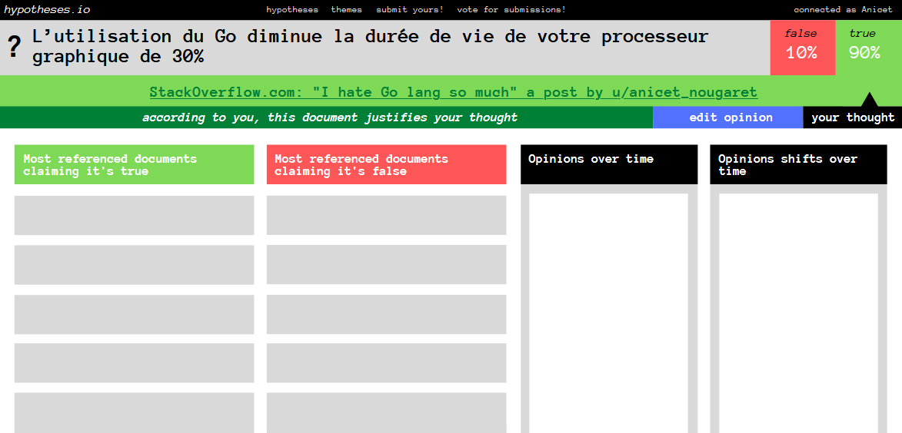
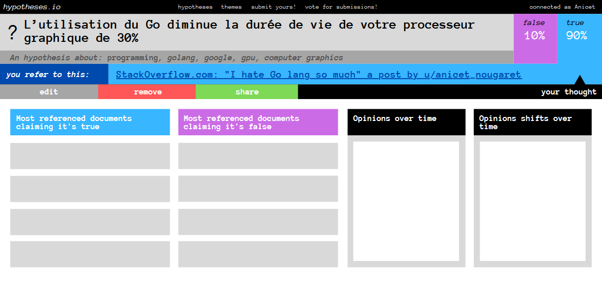

# Idée de solution n°2
Un site web : hypothesis.io, où l'on peut soumettre des hypothèses, voter pour ou contre en citant sa source principale, et accéder à des informations utiles aux chercheurs et aux journalistes, telles que les sources les plus citées par les deux partis, les graphiques des votes en fonction du temps et la recherche d'hypothèses par thème et par centre de gravité des votes.

## Maquette
Cette idée m'est apparue de façon très visuelle, donc j'ai commencé par faire une maquette rapide :

*maquette initiale*

*maquette revisitée*

## Philosophie
Le but est de proposer des données riches sur les débats existant ou ayant existé autours d'hypothèses et de faits controversés.

L'approche serait de ne modérer aucun sujet et de ne stigmatiser/prioriser aucun avis afin d'attirer le plus de données que possible.

En effet, le problème avec la lutte contre les fake news réside parfois selon moi dans la censure et la stigmatisation de ceux qui croient aux théories farfelues et aux fake news.

La stigmatisation rend le débat plus virulent et moins lisible, alors que la censure tait le débat et limite donc l'information disponible aux chercheurs, sans parler de la possibilité de censurer à tort.

Je pense que si l'on veut apprendre à combattre les fake news, il faut d'abord comprendre les sources et les discours qui les influencent.

Pour cela, je propose de laisser chacun défendre ses opinions de façon équitable et sans préjugés sur la plateforme à l'aide de sources interposées que chacun essaiera de mettre en valeur.

Afin d'éviter que la qualité du débat ne se dégrade en laissant trop les utilisateurs s'exprimer, on se limitera au vote et à l'ajout de sources tierces faisant preuve d'arguments, ainsi les chercheurs et journalistes pourront s'épargner un surplus d'avis d'internautes en accédant immédiatement aux sources les plus populaires, et donc probablement les plus importantes à mettre en valeur ou à débunker.

De part sa neutralité, les leviers d'action que le site mettra en place contre les fake news pourront alors paraître aussi puissants que ceux mis en place, malgré lui, contre les information vérifiées.

Heureusement, la plateforme aidera peut-être ceux qui croient aux fake news à s'intéresser aux avis contraires, notamment grâce à une mise en valeur équitable des sources citées par les deux partis. 

En effet, convaincu que les fausses croyances naissent plutôt d'une absence de sources fiables que d'une surreprésentation de sources mythomanes, ma conjecture est qu'il soit plus facile pour l'utilisateur de changer d'avis lorsque ses propres sources sont placées à côté de sources contradictoires plus sérieuses, que l'inverse.

Que cela soit vrai ou faux, je pense que cette approche pourra au moins être une expérience pertinente dans la recherche sur la lutte contre les fake news.

De plus, l'on pourra toujours demander le soutien de plusieurs institutions tierces de confiance par le futur (journeaux, groupes de recherches, ONGs) qui pourront exprimer publiquement leur avis sur le site.

## Fonctionnalités
1. Soumission d'hypothèses (phrases affirmatives) par pétition
   - Les hypothèses dépassant un certain nombre de signatures seront ajoutées
     - *+: processus automatique*
     - *-: modération nécessaire pour éviter les "hors-sujets"*
   - Les signatures ne seront jamais perdues avec le temps, mais pourront être retirées par leur émetteurs
   - La soumission sera anonyme, mais requierera un compte sur la plateforme
     - *+: discrétion et anonymat -> honnêteté et sujets tabous*
2. Recherche et découverte d'hypothèses
   - Chaque hypothèse se verra attribuer des tags par leur emetteur parmi une gamme existante
   - L'administration pourra changer les tags d'une hypothèse
   - Si un tag souhaité est indisponible, il pourra être ajouté, mais ne sera visible qu'une fois approuvé par l'administration
   - Les pétitions et les hypothèses approuvées pourront être parcourues dans deux pages distinctes avec des filtrages par tags
3. Ajout d'opinion sur une hypothèse (vrai, faux) avec source obligatoire
   - Une page par hypothèse sur laquelle on peut voter 
   - Affichage du pourcentage de "pensent que c'est vrai" et "pensent que c'est faux"
   - Seuls les utilisateurs login pourront donner leur opinion
   - Chacun pourra changer d'opinion à tout moment ou changer sa source
   - La source (lien internet) sera analysée par le système qui devra en extraire les meta-données pour l'affichage et l'identification des doublons
4. Affichage détaillé d'une hypothèse
   - Ajout d'un tableau des sources les plus citées par les deux partis en dessous de l'interface d'opinion
   - Ajout de graphiques divers
     - nombre de "pensent que c'est vrai" et "pensent que c'est faux" sur le temps
     - nombre de changement d'avis sur le temps
     - diversité des sources en fonction du temps et de l'opinion
5. Ajout d'une rubrique "Ce qu'ils en pensent"
   - Avis d'experts ou d'institutions de confiance cités par l'équipe de modération et ajoutés aux hypothèses les plus populaires  